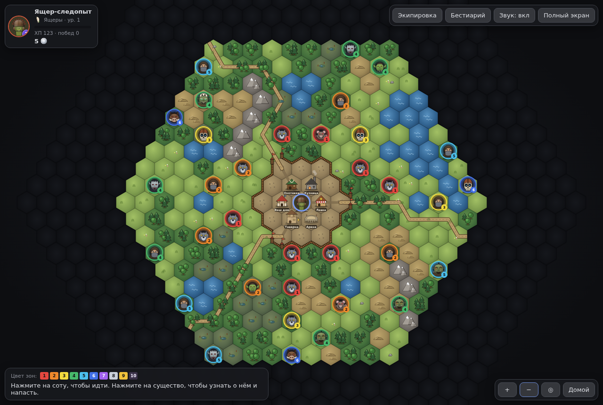
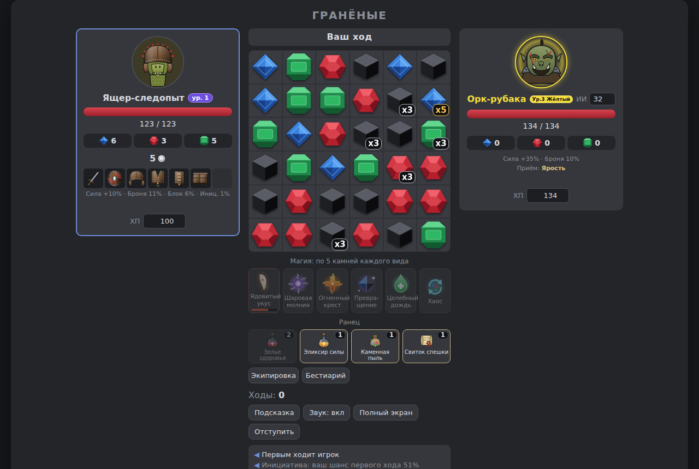
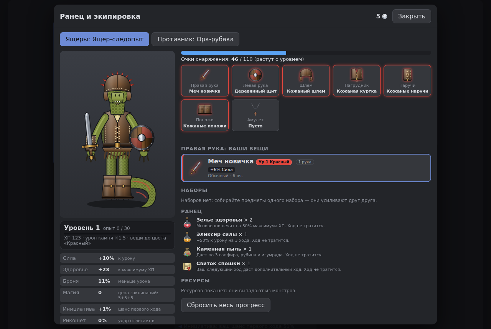
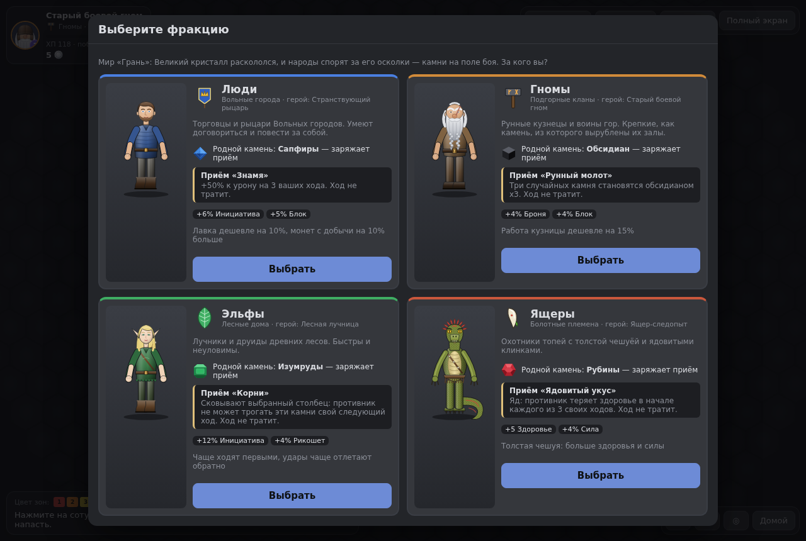

# World in Pieces («Хрупкий мир»)

Головоломка «три в ряд» на поле 6×6: сапфиры, рубины, изумруды и чёрные кубы обсидиана.
Игра начинается на карте из шестиугольников: деревня в центре, вокруг — существа из бестиария.
Нападаете на существо — начинается бой «три в ряд» против противника, который ходит сам.
При первом запуске вы выбираете фракцию: Люди, Гномы, Эльфы или Ящеры.







## Фракции



| Фракция | Герой | Родной камень | Врождённые бонусы | Вне боя | Приём в бою |
|---|---|---|---|---|---|
| **Люди** (Вольные города) | Странствующий рыцарь | сапфир | Инициатива +6%, Блок +5% | лавка дешевле на 10%, монет с добычи +10% | *Знамя* — +50% к урону на 3 ваших хода |
| **Гномы** (Подгорные кланы) | Старый боевой гном | обсидиан | Броня +4%, Блок +4% | работа кузницы дешевле на 15% | *Рунный молот* — три случайных камня становятся обсидианом x3 |
| **Эльфы** (Лесные дома) | Лесная лучница | изумруд | Инициатива +12%, Рикошет +4% | — | *Корни* — противник не может трогать выбранный столбец свой следующий ход |
| **Ящеры** (Болотные племена) | Ящер-следопыт | рубин | Здоровье +5, Сила +4% | — | *Ядовитый укус* — противник теряет здоровье в начале каждого из 3 своих ходов |

- Приём заряжается родными камнями: нужно 15 с учётом номинала (x3, x5) и бонуса линии. Приём ход не тратит.
- Врождённые бонусы в таблице — для 1-го уровня; они растут вместе с уровнем героя.
- Фракции уравнены симулятором: «средний» игрок каждой фракции выигрывает 60–63% боёв (см. [docs/balance.md](docs/balance.md)).
  Кнопка приёма — первая в полосе магии, под ней полоска заряда.
- У каждой фракции свой набор из 5 вещей («Корона» у людей, «Руна» у гномов, «Роща» у эльфов, «Чешуя» у ящеров).
  Надеть их может только своя фракция. Они продаются в лавке, создаются в кузнице и падают с существ.
- Сменить фракцию можно в Ратуше; чужие вещи при этом снимаются, но остаются в ранце.

## Уровень героя

- Опыт даётся за победы. Опыта на следующий уровень нужно всё больше: 30 на 2-й уровень, 1300 — на 50-й.
  До 50-го уровня — около 290 боёв.
- На каждый цвет — 5 уровней (1–5 — Красный, 6–10 — Оранжевый, …, 46–50 — Обсидиановый). С уровнем растут
  **базовое ХП** и **урон камней** — тем же темпом, что ХП и урон существ, поэтому герой своего уровня и
  существо своего цвета сражаются на равных на любом цвете. Растёт и **лимит очков снаряжения**.
- Вещь цвета N можно надеть с уровня (N − 1) × 5 + 1: Оранжевую — с 6-го, Обсидиановую — с 46-го.
- Опыт за победу: сильнее вид и выше цвет — больше опыта; существо ниже вашего цвета даёт заметно меньше.
- Уровень и полоска опыта видны на карте (в углу), в Ратуше и в окне «Ранец и экипировка».

## Карта

- Средняя карта: шестиугольник радиуса 14 (631 сота). У каждого игрока своя карта (из случайного зерна),
  она не меняется между запусками.
- **Местность:** луг, лес, холмы, болото — проходимы (по дороге быстрее, по болоту медленнее);
  озёра и горы — нет. Три дороги ведут из ворот деревни к краю карты, через озёра — мосты.
- **Деревня** за частоколом: Ратуша (сюда вы возвращаетесь после поражения), Лавка, Кузница,
  Охотничий дом (бестиарий), Ваш дом (экипировка). Таверна (задания) и Арена (бои с игроками) появятся позже.
- **Туман войны:** видно на 3 соты вокруг, с холмов — на 4. Встреченные существа попадают в бестиарий.
- **Существа** стоят на сотах. Цвет растёт с удалением от деревни: у стен Красный и Оранжевый, на краю Золото и Обсидиановый.
  В средних и дальних зонах встречаются враги-народы: **орки** (рубаки и шаманы) и **нежить** (скелеты, упыри, призраки).
  Нажмите на существо — увидите его силу, добычу и оценку опасности (Лёгкий / Равный / Опасный / Смертельный).
- **Бой:** «Подойти и напасть». Победа — добыча, на месте существа остаются кости, а само существо
  возвращается через 4 минуты. Поражение — вы очнётесь в деревне. «Отступить» — уйти из боя без награды.
- **Управление:** нажатие на соту — идти (путь строится сам и обходит препятствия); перетаскивание — двигать карту;
  колесо мыши, щипок двумя пальцами или кнопки «+»/«−» — масштаб; «◎» — к герою; «Домой» — вернуться в деревню.

## Правила боя

- Меняйте местами соседние камни, чтобы собрать линию из 3 и более одинаковых.
- **Обсидиан** наносит противнику урон, равный числу собранных камней с учётом номинала камня (x3, x5).
  Сапфиры, рубины и изумруды копятся для магии.
- **Бонус линии:** 4 камня — x2, 5 — x3, 6 — x10. Линия из 4 и более камней даёт **дополнительный ход**.
- Собранные камни исчезают, остальные падают вниз, затем сдвигаются вправо. Новые камни появляются,
  только когда поле разобрано или не осталось ходов.
- **Магия** стоит по 5 камней каждого вида (сапфиры, рубины, изумруды), заклинание занимает ход:
  - *Шаровая молния* — на один ход камни любого цвета наносят урон по номиналу.
  - *Огненный крест* — сжигает строку и столбец выбранной клетки; урон равен номиналам сожжённых камней.
  - *Превращение* — выбранный камень и все камни его цвета в области 3×3 становятся обсидианом.
  - *Целебный дождь* — лечит на сумму номиналов сапфиров, рубинов и изумрудов на поле.
  - *Хаос* — перемешивает все камни на поле.
- **Экипировка** (кнопка «Экипировка» или клик по аватару): правая и левая рука (оружие в одну или две руки, щит),
  шлем, нагрудник, наручи, поножи и амулет. Предметы дают характеристики:
  - *Сила* — +% к наносимому урону;
  - *Здоровье* — прибавка к максимуму ХП;
  - *Броня* — −% к получаемому урону (максимум 60%);
  - *Магия* — каждые 4 очка снижают цену заклинаний на 1 камень каждого вида (минимум 2);
  - *Инициатива* — +% к шансу первого хода в бою (базовый шанс 50%, решает разница инициатив);
  - *Рикошет* — шанс (максимум 40%), что удар отлетит в нападающего: отлетает урон за вычетом брони цели;
  - *Блок* — шанс (максимум 50%) полностью заблокировать удар.

  У каждого предмета свой набор характеристик.

  Предметы из одного набора («Страж», «Берсерк», «Чародей», «Странник») дают бонусы за 2, 3, 4… надетых вещи.
  Каждый предмет стоит очков снаряжения; лимит растёт с уровнем героя. Менять снаряжение можно до первого хода боя.
  В окне ранца видна полноростовая фигура вашего героя (рыцарь, гном, лучница или ящер) в надетой экипировке.
- **Ранец** (ход не тратится): зелье здоровья (+30% ХП), эликсир силы (+50% урона на 3 хода),
  каменная пыль (+3 камня каждого вида), свиток спешки (следующий ход даст дополнительный ход).
- **Награды:** победа даёт опыт, монеты, ресурсы, иногда вещь (шанс 20%) и расходник (25%).
  Прогресс хранится в браузере. Противник получает снаряжение и расходники по своему уровню.
- **Цвета-уровни.** Десять уровней по возрастанию мощи: сначала радуга — Красный, Оранжевый, Жёлтый, Зелёный,
  Голубой, Синий, Фиолетовый, затем Серебро, Золото и Обсидиановый. Уровень есть у вещей, монстров и ресурсов.
  ХП и урон существ растут с цветом ×1 → ×9, Сила вещей и существ — ×1 → ×2,35, шансы (Броня, Блок, Рикошет,
  Инициатива) — ×1 → ×2,1, Здоровье вещей — как ХП. Цвет задаёт и цену, и добычу; он виден на рамках, свечении иконок и метках.
  Тёмный обсидиановый уровень обведён светло-лиловым, чтобы его было видно на тёмном фоне.
- **Деньги** — медные, серебряные и золотые монеты: 100 медных = 1 серебряная, 100 серебряных = 1 золотая.
- **Бестиарий** — 13 видов существ из семейств: Звери (крыса, волк, кабан), Разбойники, Гоблины, Нежить (скелет, упырь, призрак),
  Орки (орк-рубака, орк-шаман), Великаны (тролль), Каменные стражи (голем), Драконы.
  Вид попадает в бестиарий, когда вы встретили его на карте; «Показать на карте» находит ближайшее такое существо.
  Врождённые способности, ХП и урон растут с цветом; ИИ — на 1 за цвет.
- **Оценка опасности** (карточка существа и бестиарий): Лёгкий, Равный, Опасный или Смертельный и примерный шанс
  победы. Её считает модель, обученная на симуляторе: «Равный» — это около 55–80% побед (в среднем ~67%).
- **Приёмы существ** (у каждого вида свой):

  | Существо | Приём |
  |---|---|
  | Крыса | *Воровство* — иногда крадёт 2 ваших камня для магии |
  | Волк | *Вой* — каждый третий ход бьёт на 50% сильнее |
  | Разбойник | *Подлый удар* — с шансом 25% бьёт в обход брони |
  | Гоблин | *Пакость* — иногда меняет местами два камня на поле |
  | Скелет | *Неупокоенный* — один раз за бой встаёт с 25% здоровья |
  | Кабан | *Натиск* — первый удар в бою двойной |
  | Тролль | *Регенерация* — в начале каждого своего хода лечит 5% здоровья |
  | Каменный голем | *Окаменение* — каждый третий ход сковывает вам столбец |
  | Призрак | *Туман* — каждый второй ход прячет от вас 5 камней |
  | Дракон | *Огненное дыхание* — каждый четвёртый ход сжигает ряд, урон — двойные номиналы |
  | Орк-рубака | *Ярость* — раненый (меньше половины здоровья) бьёт на 40% сильнее |
  | Орк-шаман | *Шаманский бубен* — каждый третий ход все собранные им камни наносят урон |
  | Упырь | *Кровопийца* — лечится на половину нанесённого урона |
- **Добыча:** монеты, ресурсы цвета монстра (шкура, клык, кость, железный лом, руда, кристалл, эссенция, чешуя)
  и с шансом 20% вещь.
- **Лавка** (здание в деревне): покупка и продажа вещей, расходников и ресурсов. Ассортимент обновляется после боя, а уровень
  товаров растёт с вашими победами.
- **Кузница** (здание в деревне): повышение цвета вещи на 1 (ресурсы ТЕКУЩЕГО цвета вещи + монеты) и создание вещи
  любого цвета до цвета вашего уровня из ресурсов этого цвета. Цены расходников в лавке растут с уровнем героя.
- **Неверный ход** (ничего не собралось): −5% максимума ХП (на 1-м уровне это 5–6 ХП; штраф растёт вместе с ХП), ход переходит к противнику. Три неверных хода подряд — поражение.
- Для проверки баланса ХП обоих бойцов и уровень ИИ противника можно подправить в панелях боя; ручная правка ХП
  действует только в текущем бою, и награды за такой бой нет.

## Баланс

Все числа баланса — в `js/balance.js`; они подобраны симулятором боёв. Итоги, таблицы и как перепроверить —
в [docs/balance.md](docs/balance.md). Коротко: бой длится 8–12 ходов героя, «средний» игрок побеждает обычных
существ своего цвета в 60–75% боёв, опасных — в 35–55%, дракона — примерно в каждом четвёртом бою.

## Полный экран

Кнопка «Полный экран» (или клавиша F) разворачивает игру на весь экран. Раскладка подстраивается под экран:
монитор, планшет, телефон в вертикальном и горизонтальном положении.
На iPhone Safari настоящий полный экран недоступен — там игра занимает всё окно, а ещё удобнее
добавить её на главный экран («Поделиться» → «На экран Домой»): она откроется без панелей браузера.
То же работает на Android («Установить приложение» / «Добавить на главный экран»).

## Запуск

Сборка не нужна: откройте `index.html` в браузере.

Для GitHub Pages: Settings → Pages → Deploy from a branch → `main` / root.
(На бесплатном тарифе Pages работает только с публичными репозиториями.)

## Структура

- `js/engine.js` — правила поля без интерфейса (совпадения, бонусы, падение, сдвиг, каскады)
- `js/ai.js` — противник: глубина просчёта, точность и использование магии зависят от уровня
- `js/game.js` — игра: ходы, анимации, магия, интерфейс (настройки в `RULES`)
- `js/gems.js` — графика камней и иконок магии
- `js/tiers.js` — уровни-цвета и деньги (без интерфейса)
- `js/factions.js` — фракции: родные камни, бонусы, приёмы (без интерфейса)
- `js/items.js` — предметы, наборы, характеристики, цены, кузница (без интерфейса)
- `js/balance.js` — все числа баланса в одном месте
- `js/combat.js` — правила боя без интерфейса: урон, блок, броня, рикошет, приёмы, расходники, оценка опасности
- `js/hero.js` — уровни героя: опыт, ХП и урон по уровню, лимит снаряжения, уровень для вещей
- `tools/sim.js`, `tools/balance.js`, `tools/career.js` — симулятор боёв, отчёт о балансе, карьера героя
- `docs/art-spec.md` — какие файлы графики ждёт игра (папка `art/`), их вид и имена; промты для ChatGPT — на отдельной странице
- `js/bestiary.js` — монстры, ресурсы и добыча (без интерфейса)
- `js/parts.js` — как выглядит каждая вещь (кольчуга, латы, оружие, щиты и др.)
- `js/monsterart.js` — рисунки монстров, иконки ресурсов и монет
- `js/screens.js` — Лавка, Кузница, Бестиарий, выбор фракции
- `js/hexmap.js` — карта без интерфейса: соты, местность, деревня, дороги, существа, поиск пути
- `js/mapart.js` — графика карты: местность, деревья, горы, вода, здания деревни
- `js/mapview.js` — экран карты: камера, туман войны, ходьба, карточки существ, переход в бой и обратно
- `js/itemicons.js`, `js/figures.js` — иконки предметов, фигуры героев (рыцарь, гном, лучница, ящер) и дракона, аватары
- `js/inventory.js` — профиль игрока (вещи, деньги, ресурсы, прогресс) и окно «Ранец и экипировка»
- `js/sound.js` — звуки, синтезируемые в браузере
- `manifest.webmanifest`, `icons/` — запуск с главного экрана телефона в полноэкранном режиме
- `css/style.css` — оформление
- `tests/*.test.js` — тесты правил поля, снаряжения, экономики, карты, фракций, уровней, правил боя и баланса

## Тесты

```
npm test
```

## Версия

Номер версии — вида `MAJOR.MINOR.PATCH` (например `1.0.0`), указан в `package.json` (поле `version`).
При выпуске новой версии числа увеличиваются и на GitHub ставится тег с тем же номером (например `v1.0.0`).

## Лицензия

Все права защищены — см. файл [`LICENSE`](LICENSE). Код и материалы нельзя копировать и использовать без
письменного разрешения правообладателей.
